# **GO BROKERLESS!**
## _**Free of Concern** ["Libre de preocupación"](https://www.youtube.com/watch?v=gGY5yAQtaSg)_ 

---
# Overview
In this project, we are helping you break free from broker hassles. Our distributed ledger is built upon ethereum programming in Solidity. Let's walk through this exciting process together!

## Engaging Parties

|       Party        |    Address     |               Interpretation                 |
|--------------------|----------------|----------------------------------------------|
|          Landlord  |   `landlord`   | crypto wallet of the landloard               |
|          Tenant    |   `tenant`     | wallet address of the candidate tenant       |
|  Previous Tenant   |   `previous`   | wallet address of the previous tenant leaving|
|            Us      |     `us`       | our crypto wallet address                    |


## Escrow Account
|     Account       |       Address                |                           Interpretation                            |
|-------------------|------------------------------|---------------------------------------------------------------------|
|     Omnibus       |   `_omnibusAddress`          |  contract address of all deposits to earn interests from the bank     |


## Variables

|       Variable          |        Code         |                           Explanation                               |
|-------------------------|---------------------|---------------------------------------------------------------------|
|      Rent               |        `rent`       |  monthly rent for bidding                                           |
|      Deposit            |       `deposit`     |  deposit from the higher bidder, equivalent to one-month rent       |
|      showingfeepercent  | `showingfeepercent` |  percent of rent for showing the property to candidate tenants      |
|      servicefeepercent  | `servicefeepercent` |  as a percent of monthly rent                                       |
|      Apartment          | `apt`               |  a string combination of zip code, building number, and apt number  |


## Entity Relationship Diagram
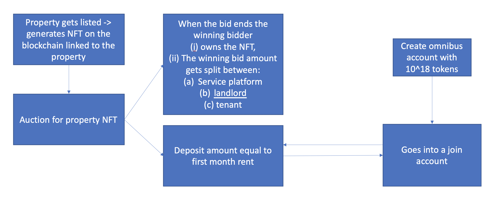

---
# Blockchain Technologies

### [Solidity](https://solidity.readthedocs.io/en/v0.6.9/)
* Target Ethereum Virtual Machine (EVM), influenced by
  * C++
  * Python
  * JavaScript
  * [Auctions](https://solidity.readthedocs.io/en/v0.6.9/solidity-by-example.html?highlight=auction)
* Extension installed in Visual Studio Code: **[Link to Github](https://github.com/juanfranblanco/vscode-solidity)**

### [Web3.js](https://web3js.readthedocs.io/en/v1.2.8/)
_See also: [Web3 on Github](https://github.com/ethereum/web3.js/)_

* API in JavaScript for Ethereum
  * libaries use HPPT or IPC to connect to nodes 
* Use **[web3.eth](https://web3js.readthedocs.io/en/v1.2.8/web3-eth.html)** package to interact with smart contract on Ethereum blockchain
  * _**See [ledger.py](Code/py_dApp/python/ledger.py)**_

    <details><summary>
    Python code 
    </summary>

    ```python
    def reportApt(landlord, report_uri):
      tx_hash = registerApt.functions.reportApt(landlord, report_uri).transact(
          {"from": w3.eth.accounts[0]}
      )
      receipt = w3.eth.waitForTransactionReceipt(tx_hash)
      return receipt
    ```

    </details>

    * _**See [record.py](Code/py_dApp/python/record.py)**_

    <details><summary>
    Code in Python
    </summary>

    ```python

    def initContract():
        with open(Path("brokerless.json")) as json_file:
            abi = json.load(json_file)

        return w3.eth.contract(address=os.getenv("REGISTERAPT_ADDRESS"), abi=abi)

    ```

    </details>

* Report apartments through python: see **[py_dApp](Code/py_dApp)**
  * ABI acquired from compiling Solidity smart contracts in Remix
    * _**[brokerless.json](Code/py_dApp/python/brokerless.json)**_
  * Environmennt setup 
    <details><summary>
    Need Pinata API and secret API keys in a file .env to access URIs
    </summary>

    ```
    PINATA_API_KEY=
    PINATA_SECRET_API_KEY=
    WEB3_PROVIDER_URI=http://127.0.0.1:8545
    REGISTERAPT_ADDRESS=0x
    ```

    </details>

  * Next step: for landlord 
    * Report and getting report on bidders
    * following similar process
  


### [Ganache](https://www.trufflesuite.com/docs/ganache/overview)
* Personal blockchain DApp for Ethereum development
* Linked with MetaMask to Localhost:8545 in this project demo
* Desktop application installed 

---


## Contracts

_**Defined in [Brokerless.sol](Code/brokerless.sol)**:_

* Auction

<details><summary>
Solidity code for capital distribution
</summary>

```solidity
      // in Constructor
        servicefeepercent = 5;
        showingfeepercent = 25;

      // within function auctionEnd() public
      // 3. Interaction
        rent = highestBid * rentPercent/100;
        deposit = highestBid * depositPercent/100;

      //leaseAddress.transfer(rent);
        omnibusAddress.transfer(deposit);
        previous.transfer(rent * showingfeepercent/100); // to previous contract to pay showingfee
        landlord.transfer(rent - (rent * showingfeepercent/100) - (rent * servicefeepercent/100));
        us.transfer(rent * servicefeepercent/100);

```
</details>

* Lease

<details><summary>
Solidity code for deposit return
</summary>

```solidity

    function returnDeposit() external 
    onlyLandlord
    {
        Omnibus omnibus = Omnibus(omnibusAddress);
        omnibus.releaseDeposit(tenant, landlord, deposit);
    }

```
</details>

* Omnibus

<details><summary>
Solidity code for computing fund allocation
</summary>

```solidity
      // in Constructor
        interestRate = 1;
        enhancedSpread = 3;
        tenantInterestSplit = 60;
        landlordInterestSplit = 20;
        usInterestSplit = 20;

      // under function releaseDeposit
        tenantInterestPayment =  (deposit * interestRate/100) + (deposit * enhancedSpread/100 * tenantInterestSplit/100);
        landlordInterestPayment = (deposit * enhancedSpread/100 * landlordInterestSplit/100);
        usInterestPayment = (deposit * enhancedSpread/100 * usInterestSplit/100);

        tenant.transfer(deposit);
        tenant.transfer(tenantInterestPayment);
        landlord.transfer(landlordInterestPayment);
        us.transfer(usInterestPayment);

```
</details>

* BankInterest

<details><summary>
Solidity code to generate funds in Omnibus bank account
</summary>

```solidity

    function generateFunds() public payable {
        
        Omnibus.transfer(msg.value);
    }

```
</details>


_**Defined under [BankInterestGenerator.sol](Code/BankInterestGenerator.sol)**_

* BankInterest

_NOTE: Funding through BankInterest contract in Omnibus account may be substituted by transfering funds in MetaMask under Localhost: 8545._

## Addresses and Variables 

<details><summary>
List of Variables and Addresses engaged in contracts
</summary>

| Contract |                              Variables                           |                              Addresses                               |
|----------|------------------------------------------------------------------|----------------------------------------------------------------------|
| Lease    |`apt`, `rent`, `deposit`, `shwoingfeepercent`, `servicefeepercent`|  landlord, tenant, us, consolidatedDeposits, previous, omnibusAddress|
| Omnibus  |`interestRate`,`enhancedSpread`,`tenantInterestSplit`,`landlordInterestSplit`,`usInterestSplit`,`tenantInterestPayment`,`landlordInterestPayment`,`usInterestPayment`     |  landlord, tenant, us       |
| Auction  | `apt`,`highestBid`,`rentPercent`,`depositPercent`,`rent`,`deposit`,`servicefeepercent`,`showingfeepercent` |  us, landlord, leaseAddress, omnibusAddress, previous, tenant      |
| BankInterest |`Omnibus`                                                     |  Omnibus = _omnibusAddress                                                     |


</details>

## State (snapshots in process)

<details><summary>
State variable for emitted events
</summary>

| Contract | Variable |             Value            |
|----------|----------|------------------------------|
| Auction  | `state`  | Started, Terminated          |
| Lease    | `state`  | Created, Started, Terminated |

</details>

## Mapping

<details><summary>
Map a variable onto positive integers
</summary>

| Contract | Variable          |             Value            |  Rationale              |
|----------|-------------------|------------------------------|-------------------------|
| Auction  | `pendingReturns`  | uint: positive integer       | withdrawals of overbids |

</details>

## Constructors

<details><summary>
Construct contracts by assigning values to variables
</summary>

| Contract   | Variable                                                           |                     Sample Code                                  |
|------------|--------------------------------------------------------------------|------------------------------------------------------------------|
| Auction    |`omnibusAddress`,`leaseAddress`,`landlord`, `apt`,`previous`,`us`,`servicefeepercent`,`showingfeepercent`|servicefeepercent = 5;       |
| Lease      |   `us`                                                             |                         us = msg.sender;                         |
| Omnibus|`interestRate`,`enhancedSpread`,`tenantInterestSplit`,`landlordInterestSplit`,`usInterestSplit`,`us`|usInterestSplit = 20; us = msg.sender;|

</details>

## Modifiers

<details><summary>
Modify conditions
</summary>

| Contract |       Modifier     |               Code               |
|----------|--------------------|----------------------------------|
| Auction  |   `inState`        | require(state == _state);        |
| Auction  |   `onlyLandlord`   | require(landlord == msg.sender); |
| Lease    |   `onlyLandlord`   | require(landlord == msg.sender); |
| Lease    |   `onlyTenant`     | require(tenant == msg.sender);   |
| Lease    |   `onlyUs`         | require(us == msg.sender);       |
| Lease    |   `inState`        | require(state == _state);        |

</details>

## Events

<details><summary>
Events for dApps to listen to
</summary>

| Contract |         Event      |               Code               |
|----------|--------------------|----------------------------------|
| Auction  |`rentIncreased`     | event rentIncreased(address bidder, uint amount);|
| Auction  |`AuctionEnded`      | event AuctionEnded(address winner, uint amount);|
| Lease    |`landlordConfirmed` | require(landlord == msg.sender); |
| Lease    |`tenantConfirmed`   | require(tenant == msg.sender);   |
| Lease    |`paidRent`          | require(us == msg.sender);       |
| Lease    |`paidDeposit`       | require(state == _state);        |
| Lease    |`returnDeposit`     | require(state == _state);        |
| Lease    |`paidShowingFee`    | require(state == _state);        |
| Lease    |`contractTerminated`| require(state == _state);        |

</details>

## Functions

<details><summary>
Nested inside contracts for various purposes
</summary>

| Contract |  Function           |                                                Purpose                                                |
|----------|---------------------|-------------------------------------------------------------------------------------------------------|
| Auction  |`bid`                | allow rent increases based on highest bid after auction starts based on State                         |
| Auction  |`withdraw`           | withdraw an overbid                                                                                   |
| Auction  |`pendingReturn`      | amount for withdraw function                                                                          |
| Auction  |`getbalance`         | return balance of the address                                                                         |
| Auction  |`auctionEnd`         | landlord end the auction: rent, deposit, fees transfered to landlord, omnibus, previous tenant and us |
| Lease    |`contruct`           | assign variables event-based values: _landlord, _omnibusAddress, _rent, _deposit, _apt)               |
| Lease    |`payRent`            | allow tenant to pay rent to landloard after contract starts as indicated by State                     |
| Lease    |`returnDeposit`      | enable landlord to reutrn depost to the leaving tenant from omnibus account upon contract termination |
| Lease    |`requestShowingFee`  | pay showing fee to the previous tenant                                                                |
| Lease    |`terminateContract`  | landlord concludes the lease contract                                                                 |
| Lease    |`getbalance`         | return balance of the contract                                                                        |
| Lease    |`() payable external`| required for the lease contract to be payable from an outside account                                 |
| Omnibus  |`releaseDeposit`     | transfer interests and principal on deposit to tenant, landlord and us based on specified schedules   |
| Omnibus  |`getbalance`         | return balance of the contract                                                                        |
| Omnibus  |`() payable external`| required for the lease contract to be payable from an outside account                                 |
| BankInterest|`generateFunds()` | transfer funds to _omnibusAddress                                                                     |

</details>

---
# Workflow

## Standing on shoulders of giants
<details><summary>
LEASEHOLD: token distribution of smart contracts on rental lease
</summary>

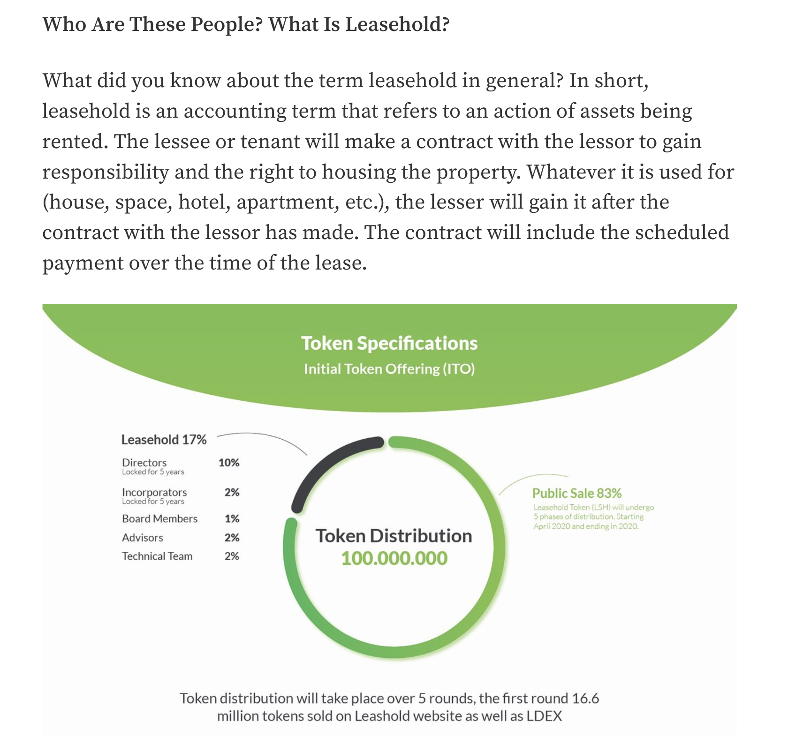
_Source: [Leasehold Token - The Decentralized Money Making Through Sort Term Rental Tokenization](https://steemit.com/blockchain/@kurniawan05/leasehold-token-the-decentralized-money-making-through-sort-term-rental-tokenization)_

</details>

## Step-by-step Guide

### _Accounts_

* Tune in [MetaMask](https://metamask.io/) to Localhost 8545.
* Balances of accounts are viewable in
[Ganache](https://www.trufflesuite.com/ganache).

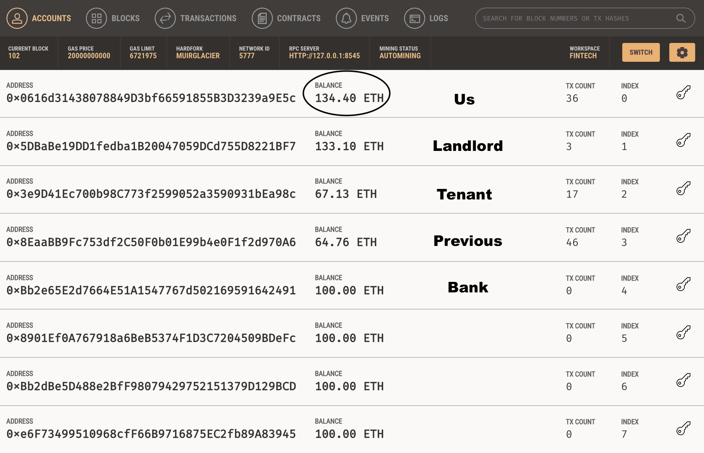

<details><summary>
Five accounts with the following wallet addresses engage in transactions on BrokerlessMarket (first five in Ganache):
</summary>

```
Us: 
0x0616d31438078849D3bf66591855B3D3239a9E5c

Landlord: 
0x5DBaBe19DD1fedba1B20047059DCd755D8221BF7

Tenant: 
0x3e9D41Ec700b98C773f2599052a3590931bEa98c

Previous: 
0x8EaaBB9Fc753df2C50F0b01E99b4e0F1f2d970A6

Bank: 
0xBb2e65E2d7664E51A1547767d502169591642491
```
</details>

---

### _Demo Transactions_

### _**Initiate Lease Contract**_

In Remix, open
[Brokerless Contract](Code/Brokerless.sol)

* As **Us** in MetaMask: 
  * Scroll and choose **Lease** under CONTRACT
  * Complile Lease Contract
  * Select _**Injected Web3**_ as ENVIRONMENT and deploy Lease Contract

    <details><summary>
    Lease Contract Deployment
    </summary>

    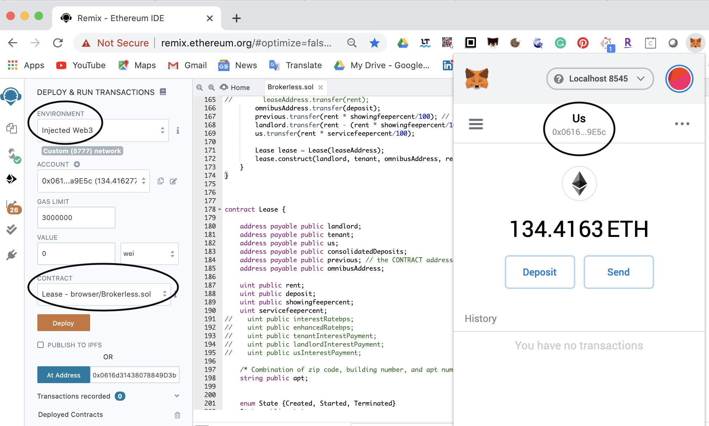

    </details>

  * After clicking the **Deploy** button, confirm on MetaMask for New Contract initiation
    * (Optional) Copy the address of the deployed Lease Contract by clicking on the page button to the right onto a .txt file: 0x0717c8C6c171E16dFE06d4df366d6fff017be521

    <details><summary>
    Notification of New Contract on MetaMask 
    </summary>

    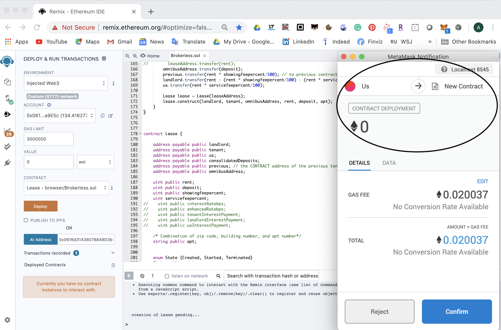

    </details>

    <details><summary>
    Confirmation of Deployment on MetaMask 
    </summary>

    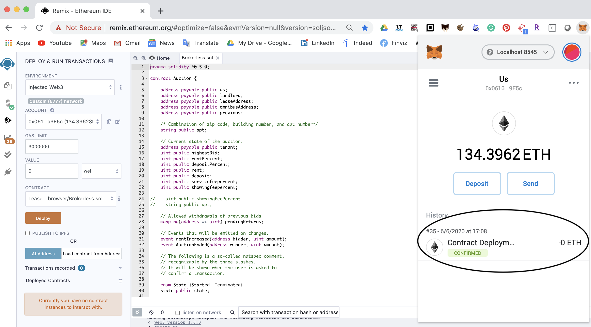

    </details>

  * Check our balance on Ganache

    <details><summary>
    Ganache Balance for Us dropped 0.02 ETH from 134.40 ETH to 134.38 ETH following Deployment of Lease Contract
    </summary>

    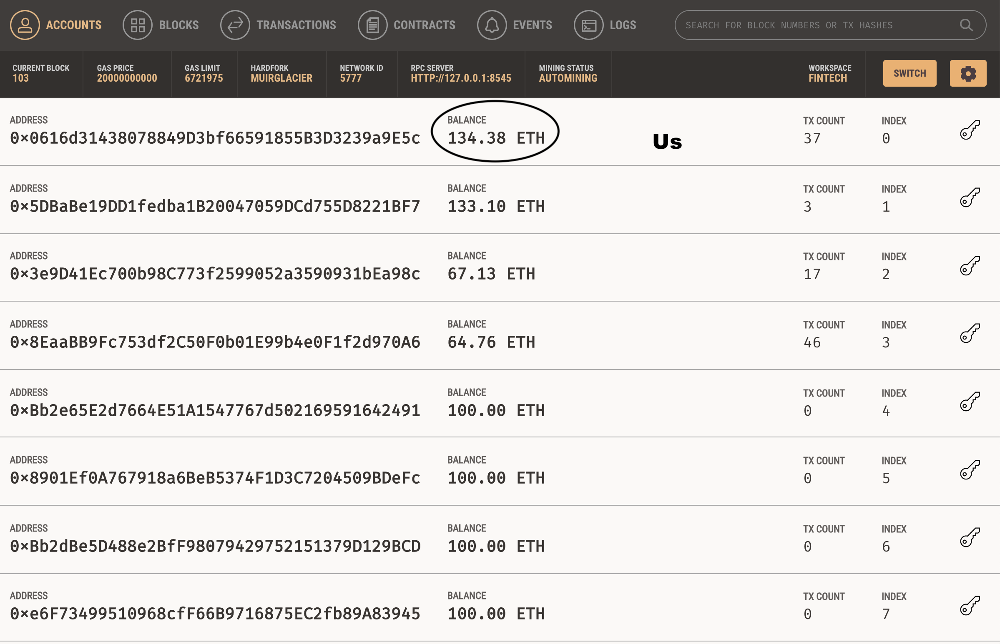

    </details>
---
### _**Initiate Omnibus Contract**_

* As **Us** in MetaMask:

  * Scroll down under CONTRACT and choose **Omnibus**
  * Compile the Omnibus Contract
  * Deploy Omnibus Contract under the same _**Injected Web3**_ ENVIRONMENT
    * (Optional) Copy the address of the deployed Omnibus Contract by clicking on the page button to the right onto a .txt file: 0x721080d169713ec439db4CaE8ED2daCEF4745B5d

    <details><summary>
    Omnibus Contract Deployment
    </summary>

    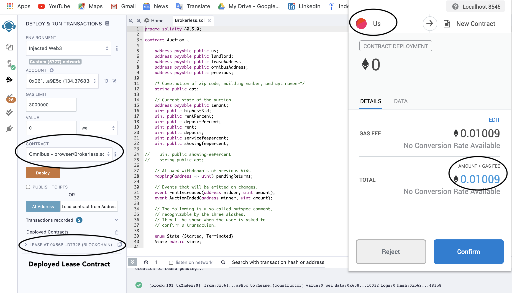

    </details>

  * Check our new balance on Ganache

    <details><summary>
    Ganache Balance for Us dropped 0.01 ETH from 134.38 ETH to 134.37 ETH following Deployment of Omnibus Contract
    </summary>

    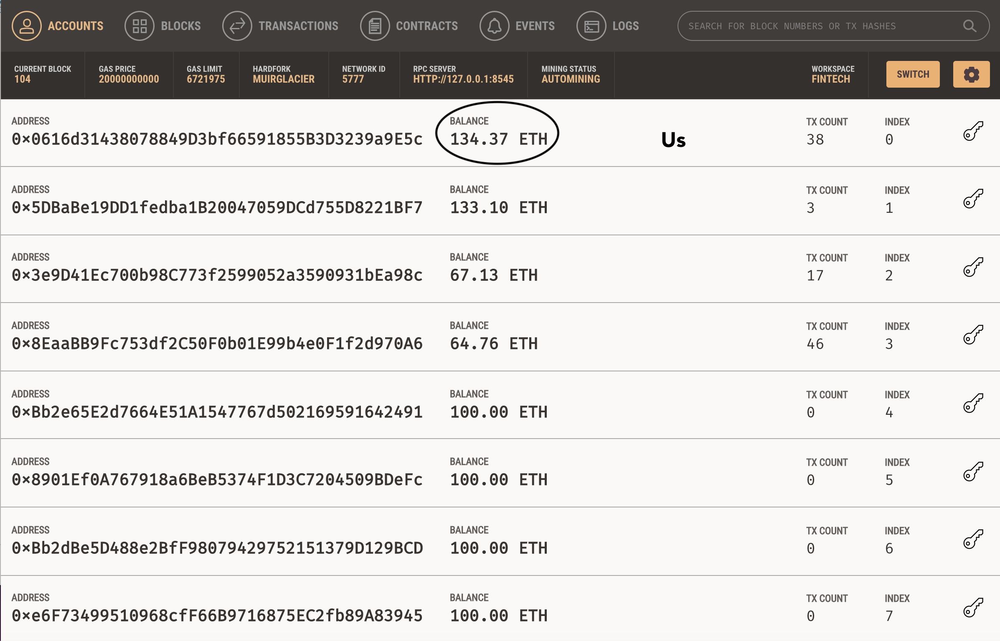

    </details>

---
### _**Initiate Auction Contract**_

* As **Us** in MetaMask:

  * Scroll down under CONTRACT and choose **Auction**
  * Compile and Deploy Auction Contract, leaving _**Injected Web3**_ ENVIRONMENT unchanged
    * (Optional) Copy the address of the deployed Auction Contract by clicking on the page button to the right onto a .txt file: 0xf3B554248FDFFc24CE7Aa14689Ed561e0350B801

    <details><summary>
    Auction Contract Deployment
    </summary>

    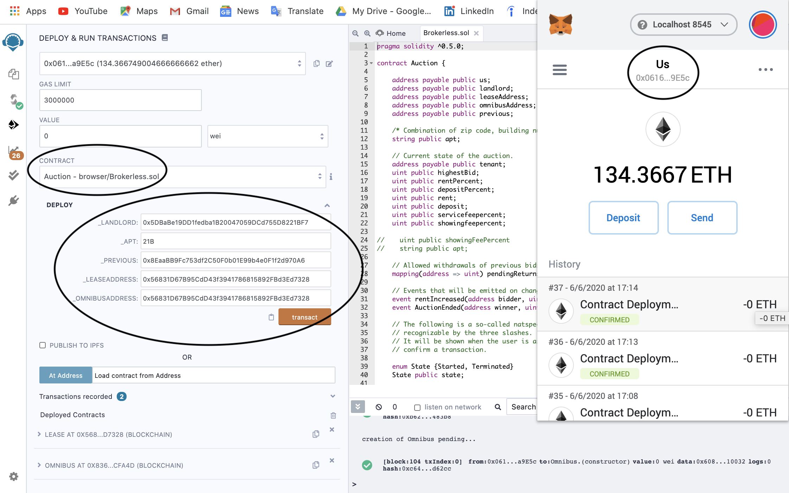

    </details>

    <details><summary>
    MetaMask Notification on Auction Contract Deployment
    </summary>

    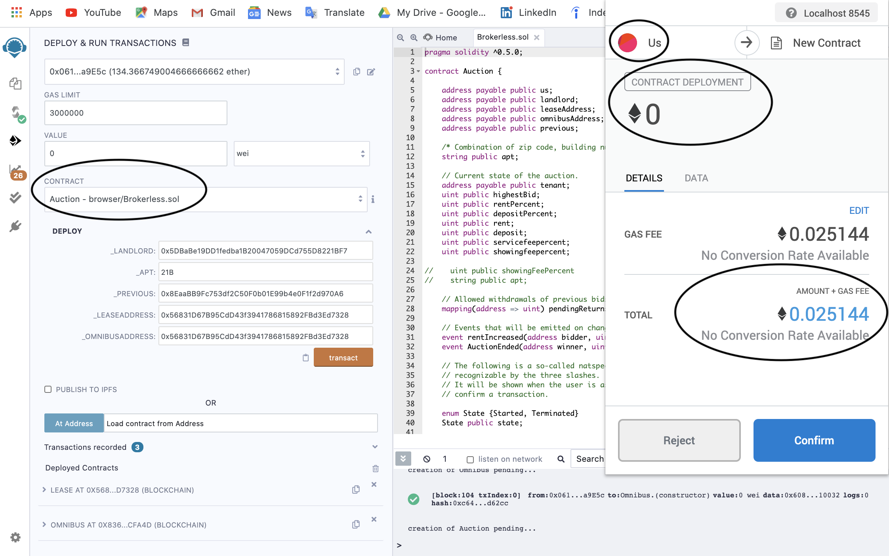

    </details>

  * Check our new balance on Ganache

    <details><summary>
    Ganache Balance for Us dropped 0.03 ETH from 134.37 ETH to 134.34 ETH following Deployment of Auction Contract
    </summary>

    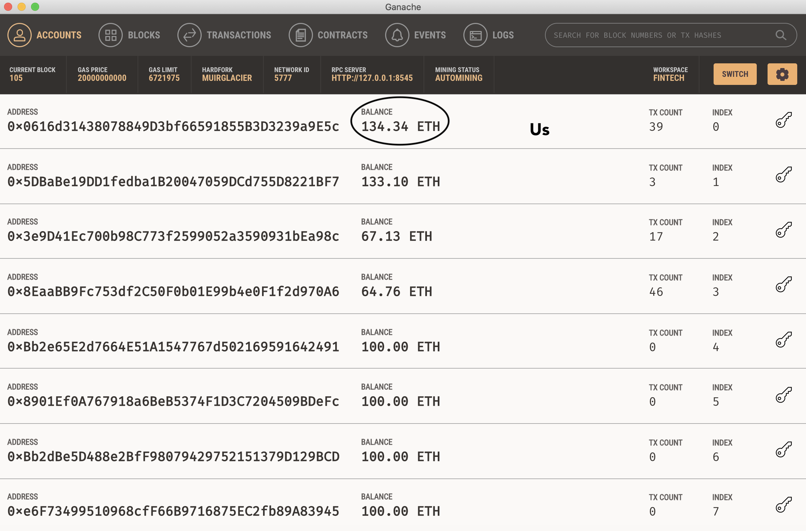

    </details>

---
### _**Bid as Tenant**_

* As **Tenant** in MetaMask, i.e. the third address from the top in Ganache:

* To initiate a bid, enter 10 ether as VALUE under CONTRACT Auction
    * Enter wallet addresses of landord, previous tenant with lease and omnibus contract addresses under DEPLOY section (may be left unchanged from Auction deployment)

  * Scroll down to unfold AUCTION under Deployed Contracts, enter 50 for _rentPercent and _depositPercent respectively for bid
  
    Tenant Bid 10 ETH with 50-50 Split on Rent and Deposit

    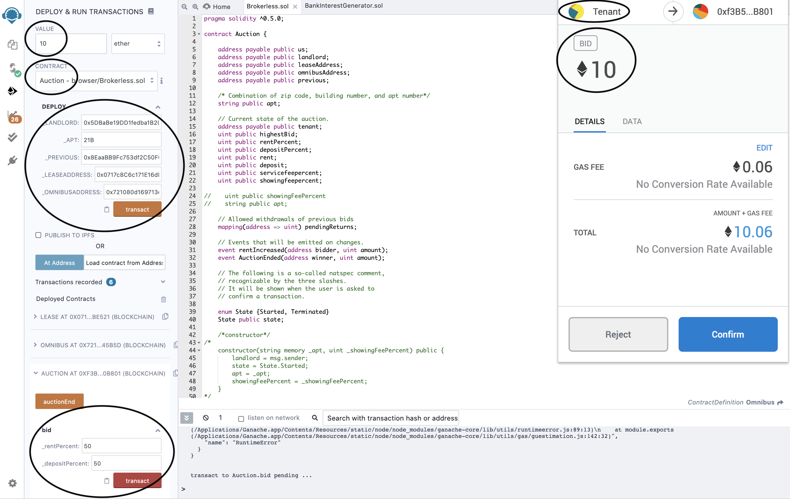


  * Compare balances on Ganache Pre and Post Tenant Bid

    <details><summary>
    Ganache Balance prior to Tenant's bid of 10 ether
    </summary>

    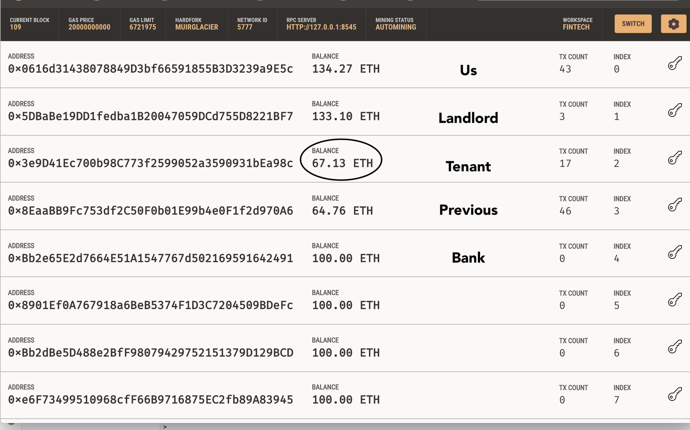

    </details>

      Balances on Ganache following Tenant's bid of 10 ether: a drop from 67.13 ETH to 57.13 ETH posted on the third wallet, i.e. the candidate tenant's account

    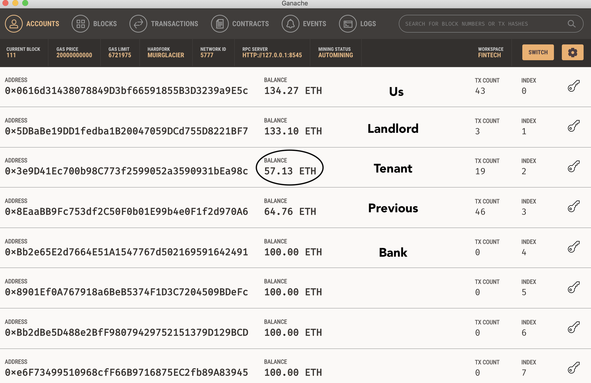


  * The auction would only proceed should there be a higher bid than 10 ether from this point

    <details><summary>
    A bid of 14 ether that is greater than the previous bid of 10 ether
    </summary>

    

    </details>

    <details><summary>
    Balances on Ganache following Tenant's bid of 14 ether: a drop from 57.13 ETH to 43.12 ETH posted on the third wallet, i.e. the candidate tenant's account. An extra 0.01 ETH gas fee incurred for the bidding.
    </summary>

    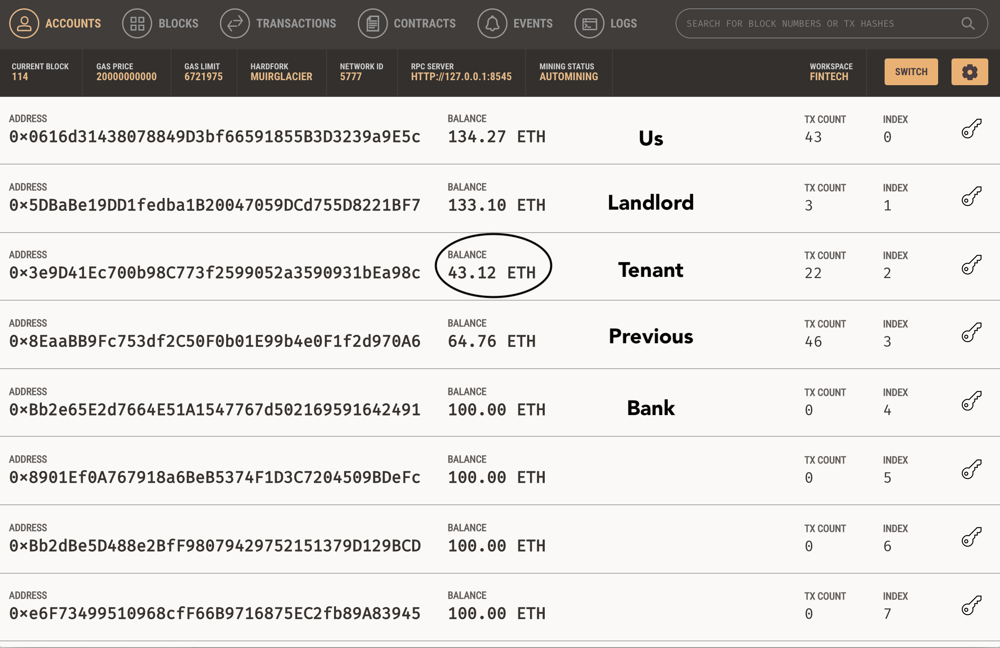

    <details><summary>
    Get Balance by pressing **getbalance** button under the Deployed Omnibus Contract: current balance is 50% of 14 ETH, i.e. 7 ETH = 7 * (10^18) Wei
    </summary>

    

    </details>

    <details><summary>
    Should there be another bid in the valud of 14 ETH. An error message would pop up as follows:
    </summary>

    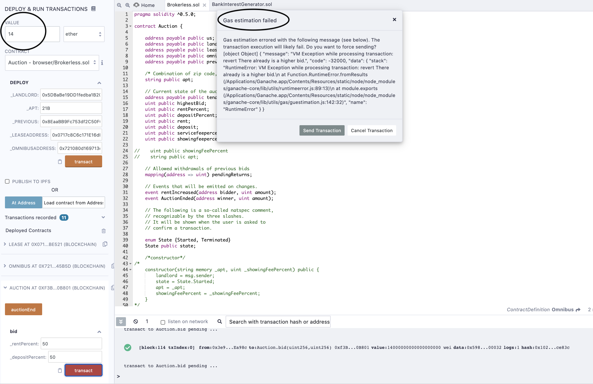

    </details>

---
### _**Depost to Generate Interest on Omnibus Bank Account**_

* As **Us** in MetaMask, i.e. the second address from the top in Ganache:

  * Open [BankInterestGenerator in Solidity](Code/BankInterestGenerator.sol)
    * Expand view on Deployed Auction Contract at the bottom left-hand-side 

  * Complile and **Deploy BankInterest** contract
    * at the previously deployed address of the Omnibus Contract under [Brokerless Solidity](Code/Brokerless.sol)**_OMNIBUSADDRESS**: 0x721080d169713ec439db4CaE8ED2daCEF4745B5d

    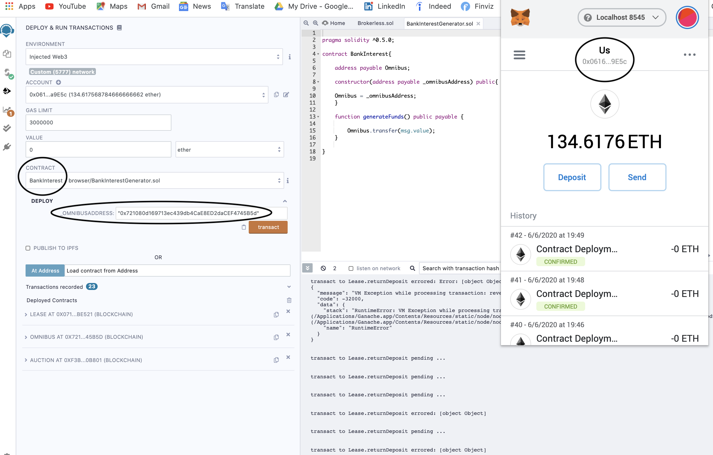

  * Confirm **CONTRACT DEPLOYMENT** on the MetaMask pop up notification window by clicking on **Confirm** button

    <details><summary>
    Confirm Deployment of BankInterest Contract
    </summary>

    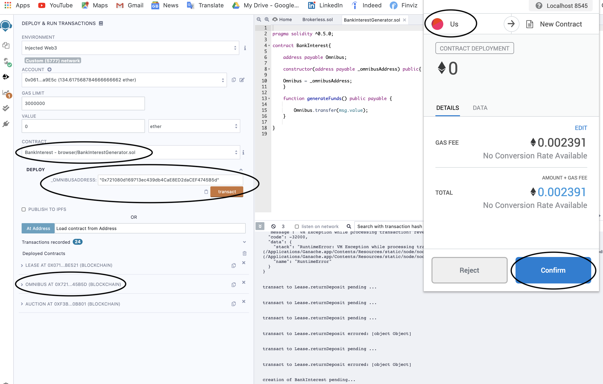

    </details>

---
### _**Get Funds from Omnibus Bank Account**_

* As **Bank** in MetaMask, i.e. the fifth address from the top in Ganache:

  * Enter _**50 ether**_ as **VALUE** on the **Remix Deployment** page
    * Keep _BankInterest_ under CONTRACT selection
    * Keep __OMNIBUSADDRESS_ the same as the address of the previously deployed Omnibus Contract from [Brokerless Solidity](Code/Brokerless.sol): 0x721080d169713ec439db4CaE8ED2daCEF4745B5d

  * Expaned view of the deployed BankInterest Contract and click on **generateFunds** button

    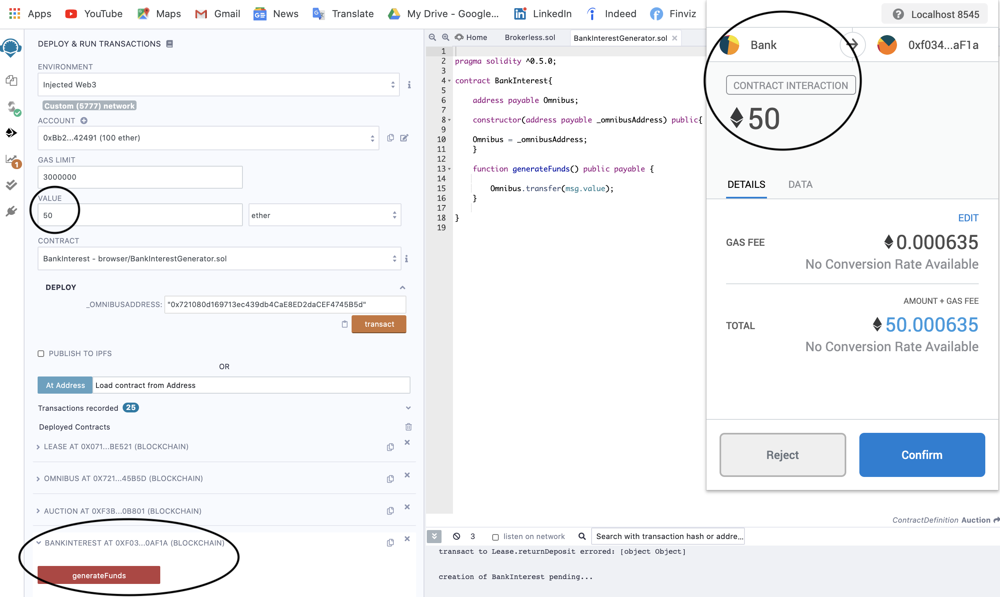

  * Confirm **CONTRACT INTERACTION** on the MetaMask notification by clicking on **Confirm** button

    <details><summary>
    Omnibus Bank Account balance dropped from 100 ETH to 49.9994 ETH. The difference is resulted from gas fee.
    </summary>

    

    </details>

      Balances on Ganache before and after the balance transfer of 50 ether are show below:

    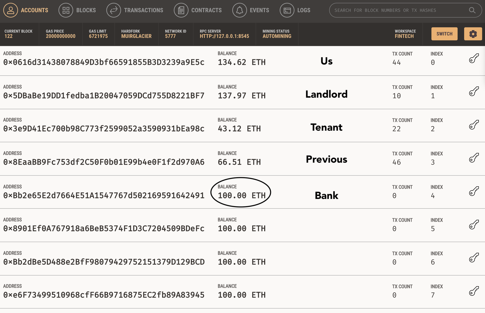

    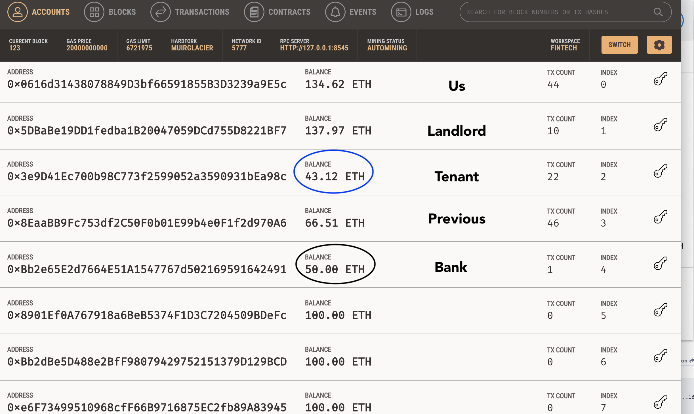

---
### _**Return Deposit**_

* As **Landlord** in MetaMask, i.e. the second address from the top in Ganache:

  * Expand view of the deployed **Lease Contract**

  * Click on **returnDeposit** button

  * Confirm on the MetaMask via **Confirm** button

    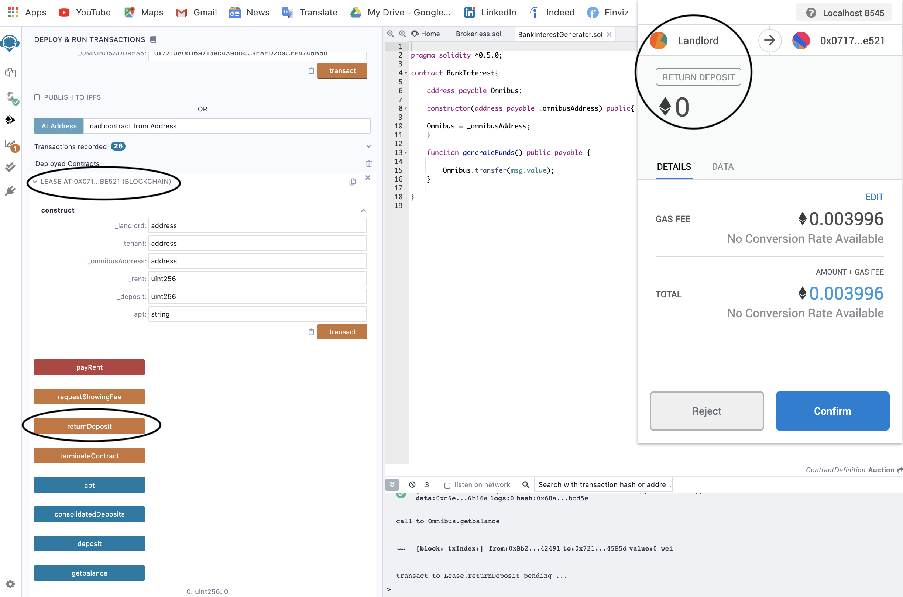

    <details><summary>
    The balance of Tenant's account went up 7 ETH from 43 ETH to 50 ETH approximately.
    </summary>

    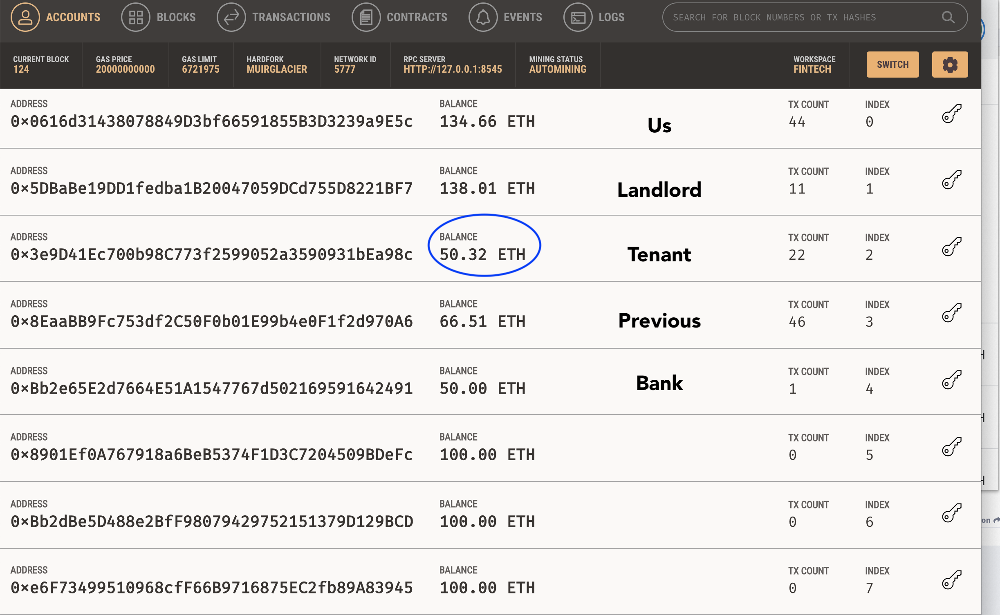

    </details>

---
### _**Conclude Auction**_

* As **Landlord** in MetaMask, i.e. the second address from the top in Ganache:

* To conclude an auction, under Auction Contract on Deployment page
    * Expand view on Deployed Auction Contract at the bottom left-hand-side 

  * Press **auctionEnd** button

  * Confirm **AUCTION END** on the MetaMask pop up notification window by clicking on **Confirm** button

    <details><summary>
    Terminate Auction by Landlord
    </summary>

    

    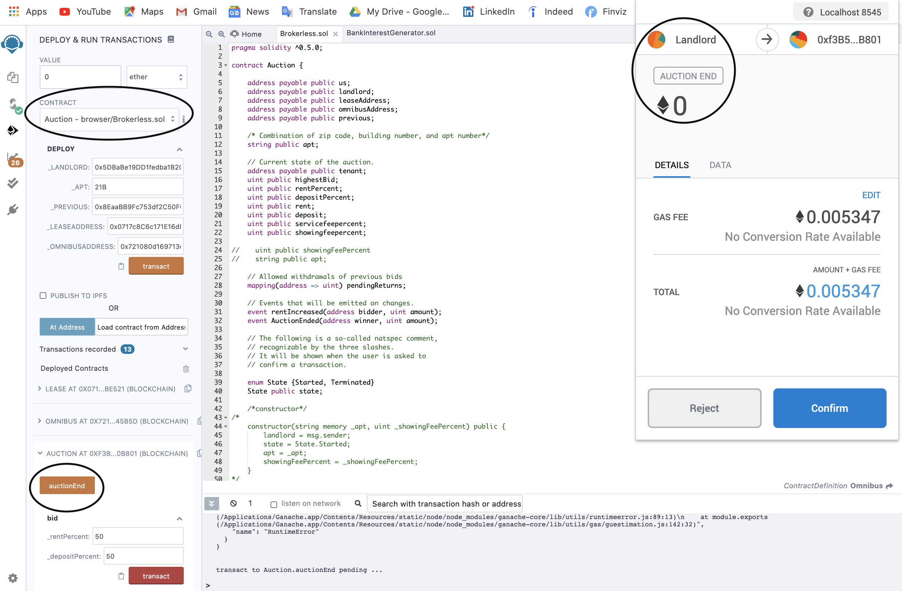

    </details>

      Balances on Ganache following Tenant's bid of 10 ether: a drop from 67.13 ETH to 57.13 ETH posted on the third wallet, i.e. the candidate tenant's account

    


<details><summary>
Archived Process for Previous Versions
</summary>

```
--------------------------------------
********CONTRACT DEPLOYMENT***********
--------------------------------------
* As Landlord deploys Auction contract 
* As Us deploy Lease contract
* As Us deploy the Omnibus contract
--------------------------------------
** Insert bank interest 5%
--------------------------------------


--------------------------------------
*********LEASE CONTRACT**************
--------------------------------------
* Set leaseAddress contract
* Set omnibusAddress contract
* As potentialTenant 1 enter bid Value and split Value between 
  rent percent and deposit percent
* As potentialTenant 2 enter higher bid Value and split Value
  between rent percent and deposit percent
* As potentialTenant 1 withdraw bid to get back money
* As Landlord end auction and accept highest bid. Resulting in the rent being transferred
  to lease contract and deposit gets transferred to the Omnibus contract
--------------------------------------
** Navigate to the Lease contract. As Landlord confirm lease contract
** As Tenant confirm lease contract
--------------------------------------


--------------------------------------
**********OMNIBUS CONTRACT***********
--------------------------------------

* Set Omnibus contract
* Set Previous contract
* Click initialPayout
* Rent payment is transferred to Landlord and Previous Tenant for showing
 the house and Us for offering the platform
--------------------------------------
** In the Previous Tenant Agreement set 
** Click PayRent 
** After duration press requestDeposit
--------------------------------------

```

</details>


---
# Results 


## _**Wix Frontend + Backend View**_
### _Hakuna matata! This is how it appears!_

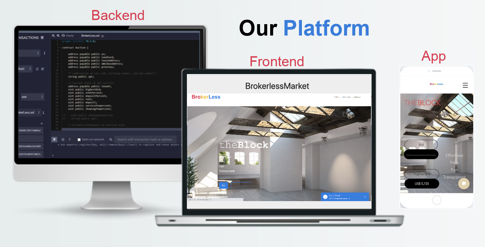


### **Frontend: Set up a Webpage on Github**

<details><summary>
Step 1: Click on `Settings` on the Github repository
</summary>

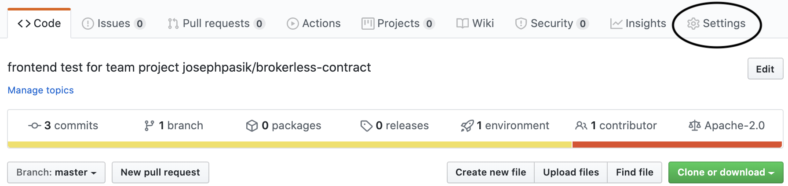

</details>

<details><summary>
Step 2: On Github Pages, select `master branch ` as `Source` and select a theme under `Theme Chooser`
</summary>

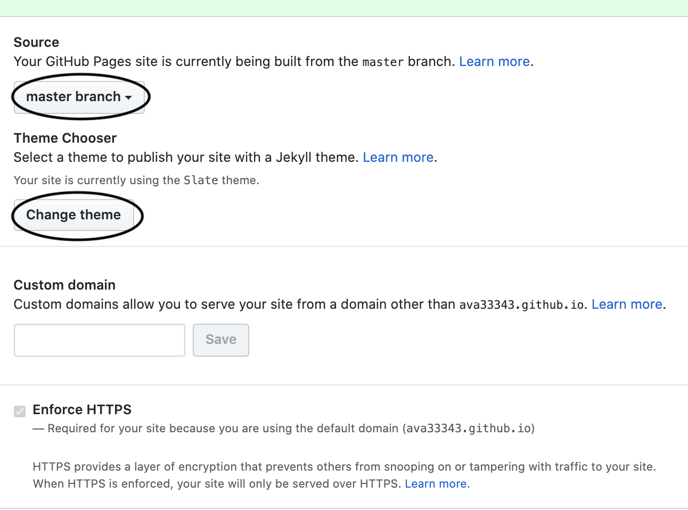

</details>

<details><summary>
Step 3: Open the link to the webpage published highlighted in green to view this page
</summary>

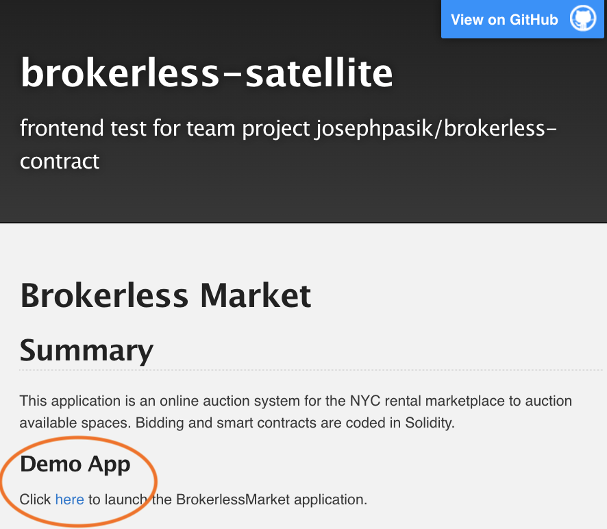

</details>

<details><summary>
Step 4: Click on the link `here` under Demo App from the previous step to bid on BrokerlessMarket 
</summary>

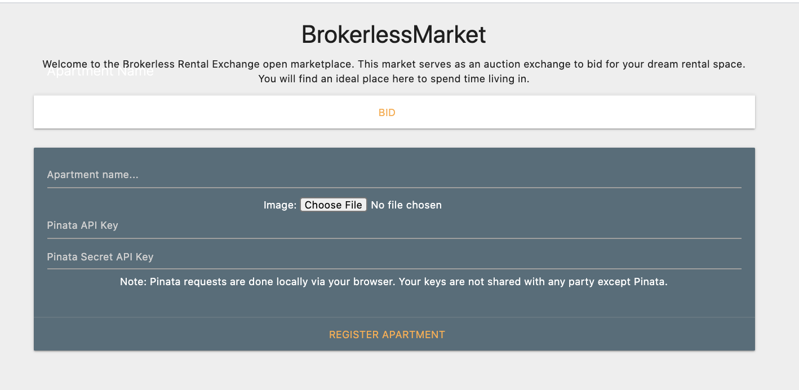

</details>

Step 5: Register an apartment by entering Apartment name, Pinata API and Secret API Key

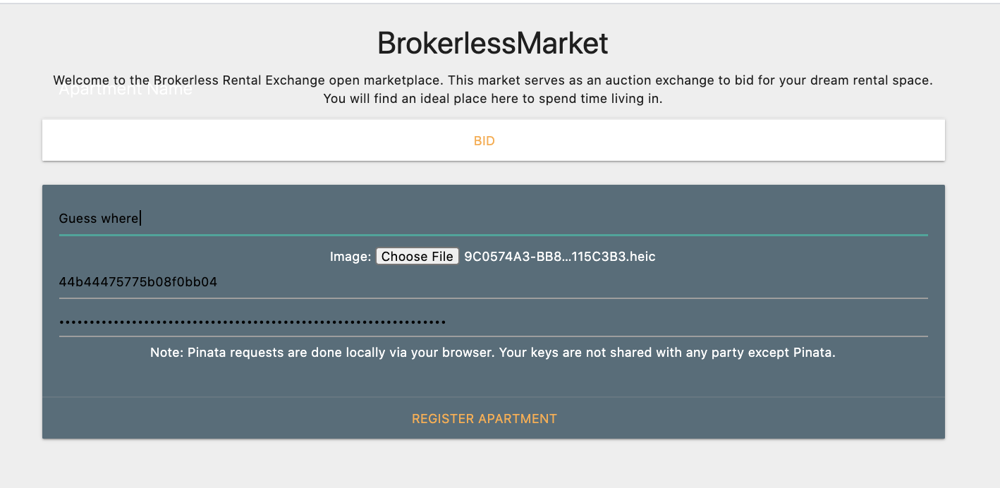


---
# Next Steps

_**We would like to elaborate on the following aspects on our project:**_

* Duration of contract
* Auction contract should create brokerless contract. 
  * Or contract factory for may empty lease contracts to exist in waiting. 
* Vetting with machine learning
  * Invest deposit with machine learning
* Add damage report 
  * for landlord, require picture submission, allow withdrawal of deposit funds
  * for bidders, from perspectives of a landlord
* Rather than auction process:
  * bidders should offer rent and deposit fee
  * Landlord should be able to choose which to accept
  * Landlord to set minimum
* Add “paper” contract as URI
  * json
  * pdf
  * png
* Allow tenants to offer a higher security deposit that the landlord is allowed to invest (전세) -> more security for the landlord (better tenants)
* Link with property listing platform
* Late fee (require payRent function even month)
* Events in place for javascript Dapps to listen to
  * For user friendly UI
* Hosting a factory of contracts for multiple apartments: [Example on Github](https://github.com/brynbellomy/solidity-auction/blob/master/contracts/AuctionFactory.sol)

---
# Files

### _**[Presentation](https://drive.google.com/file/d/1yOtBwaAWwaAazNI4HJ5oHh0SutkwNp6v/view?usp=drivesdk)**_

---

## **Solidity**

### **[Brokerless Contract](Code/Brokerless.sol)**
### **[Bank Contract](Code/BankInterestGenerator.sol)**

---
## Frontend dApps
**[BrokerlessMarket Frontend Webpage](Code/frontend_test)**

**[dApps for Property Records](Code/py_dApp)**

---

## _Supplementary_

_[Google Drive and Slack Resources](Resources/GoogleSlack)_

_[Images](Resources/Images)_


---
# References

* Columbia University Fintech GitLab Repository
* https://medium.com/@naqvi.jafar91/converting-a-property-rental-paper-contract-into-a-smart-contract-daa054fdf8a7
* https://github.com/anudishjain/CharterContracts/blob/master/Smart%20Contracts/MainContract.sol @author-Anudish Jain
* https://steemit.com/blockchain/@kurniawan05/leasehold-token-the-decentralized-money-making-through-sort-term-rental-tokenization
* https://web3js.readthedocs.io/en/v1.2.8/web3-eth-abi.html#eth-abi
* https://github.com/raineorshine/solidity-by-example
* https://github.com/brynbellomy/solidity-auction/blob/master/contracts/AuctionFactory.sol
* https://metamask.io/
* https://www.trufflesuite.com/docs/ganache/truffle-projects/events-page
* https://solidity.readthedocs.io/en/v0.6.9/solidity-by-example.html?highlight=auction
* https://remix.ethereum.org/
* https://developer.mozilla.org/en-US/docs/Web/JavaScript/Guide/Expressions_and_Operators
* https://www.w3schools.com/js/js_operators.asp
* https://flask.palletsprojects.com/en/1.1.x/
* https://javascript.info/
* https://developer.mozilla.org/en-US/docs/Learn/Getting_started_with_the_web/JavaScript_basics
* https://github.com/ethereum/web3.js/
* https://github.com/DavidAnson/markdownlint/blob/v0.20.3/doc/Rules.md#md032
* https://ethereum.stackexchange.com/questions/7139/whats-the-solidity-statement-to-print-data-to-the-console
* https://pinata.cloud/
* https://www.quickdatabasediagrams.com/
